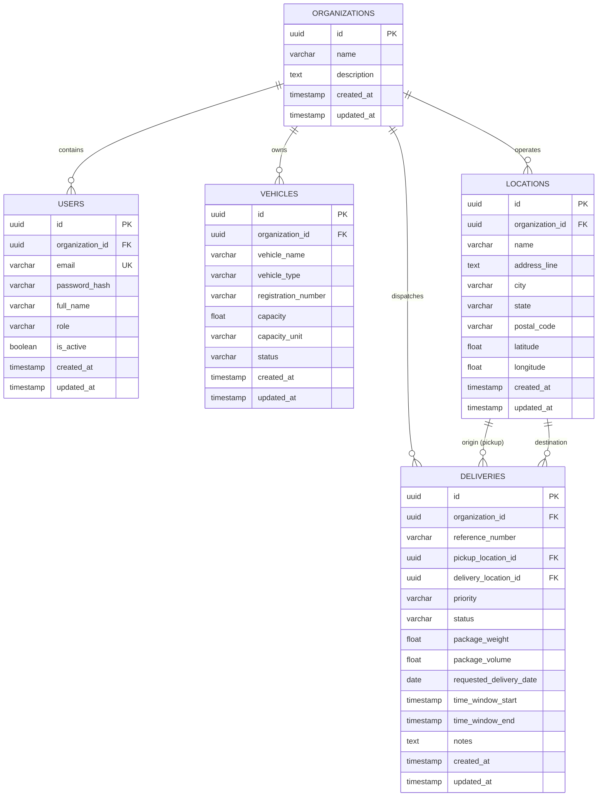

# RouteIQ 2.0 — Database Schema & Data Models

## 1. Relational Entity Relationship (ER) Model



---

## 2. Table Specifications & Constraints

### 2.1 `organizations`
- `id`: UUID (Primary Key, default `gen_random_uuid()`).
- `name`: VARCHAR(128) NOT NULL. Business entity name.
- `description`: TEXT. Optional description.

### 2.2 `users`
- `id`: UUID (Primary Key).
- `organization_id`: UUID REFERENCES `organizations(id)` ON DELETE CASCADE.
- `email`: VARCHAR(255) UNIQUE NOT NULL.
- `password_hash`: VARCHAR(255) NOT NULL (Bcrypt).
- `full_name`: VARCHAR(128) NOT NULL.
- `role`: VARCHAR(32) CHECK (`role IN ('admin', 'manager', 'operator')`).
- `is_active`: BOOLEAN DEFAULT TRUE.

### 2.3 `vehicles`
- `id`: UUID (Primary Key).
- `organization_id`: UUID REFERENCES `organizations(id)` ON DELETE CASCADE.
- `vehicle_name`: VARCHAR(128) NOT NULL.
- `vehicle_type`: VARCHAR(64) NOT NULL.
- `registration_number`: VARCHAR(64) NOT NULL.
- `capacity`: DOUBLE PRECISION CHECK (`capacity >= 0`).
- `capacity_unit`: VARCHAR(32) DEFAULT `'kg'`.
- `status`: VARCHAR(32) CHECK (`status IN ('available', 'assigned', 'inactive', 'maintenance')`).
- Unique Constraint: `(organization_id, registration_number)` prevents registration collisions within an organization.

### 2.4 `locations`
- `id`: UUID (Primary Key).
- `organization_id`: UUID REFERENCES `organizations(id)` ON DELETE CASCADE.
- `name`: VARCHAR(128) NOT NULL.
- `address_line`: TEXT.
- `city`: VARCHAR(64) NOT NULL.
- `state`: VARCHAR(64) NOT NULL.
- `postal_code`: VARCHAR(32).
- `latitude`: DOUBLE PRECISION CHECK (`latitude >= -90.0 AND latitude <= 90.0`).
- `longitude`: DOUBLE PRECISION CHECK (`longitude >= -180.0 AND longitude <= 180.0`).

### 2.5 `deliveries`
- `id`: UUID (Primary Key).
- `organization_id`: UUID REFERENCES `organizations(id)` ON DELETE CASCADE.
- `reference_number`: VARCHAR(64) NOT NULL.
- `pickup_location_id`: UUID REFERENCES `locations(id)` ON DELETE RESTRICT.
- `delivery_location_id`: UUID REFERENCES `locations(id)` ON DELETE RESTRICT.
- `priority`: VARCHAR(32) CHECK (`priority IN ('low', 'normal', 'high', 'urgent')`).
- `status`: VARCHAR(32) CHECK (`status IN ('pending', 'assigned', 'in_transit', 'delivered', 'cancelled')`).
- `package_weight`: DOUBLE PRECISION CHECK (`package_weight >= 0.0`).
- `package_volume`: DOUBLE PRECISION CHECK (`package_volume >= 0.0`).
- `time_window_start` / `time_window_end`: TIMESTAMPTZ.
- Constraint: `time_window_start <= time_window_end`.
- Unique Constraint: `(organization_id, reference_number)`.

---

## 3. Database Migration Management

All database schema evolutions are stored as tracked SQL scripts inside `database/migrations/`:
- `001_phase1_foundation.sql`: Core road nodes, edges, hazard reports, health pings.
- `002_phase2_auth_and_logistics.sql`: Organizations, users, vehicles, locations, deliveries.

### Running Migrations
Use the built-in migration runner:
```bash
# Check status of migrations
python database/migrate.py --status

# Apply pending migrations
python database/migrate.py

# Dry-run verification
python database/migrate.py --verify
```
Migrations are tracked in the PostgreSQL table `schema_migrations`.
