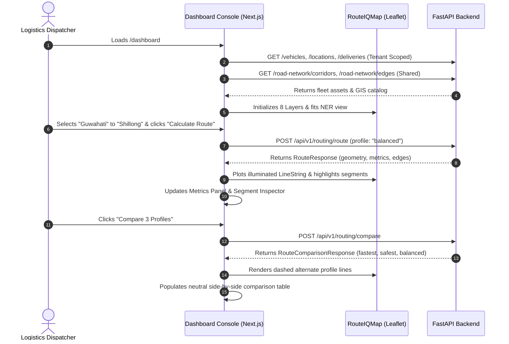

# RouteIQ 2.0 — GIS Dashboard Specification

## 1. Dashboard Component Breakdown

The GIS Operations Console is hosted at `/dashboard` and orchestrates multiple modular sub-components:

| Component | Path | Responsibility |
|---|---|---|
| `DashboardPage` | `frontend/src/app/dashboard/page.tsx` | Master view orchestrator, tenant authentication check, KPI aggregation, tab switching |
| `MapWrapper` | `frontend/src/components/map/MapWrapper.tsx` | SSR-safe dynamic wrapper with animated loading state |
| `RouteIQMap` | `frontend/src/components/map/RouteIQMap.tsx` | Core Leaflet map canvas, tile provider, 8 layer groups, interactive click handlers |
| `MapControls` | `frontend/src/components/map/MapControls.tsx` | Zoom in/out, NER view reset, layer toggles menu, legend toggle |
| `MapLegend` | `frontend/src/components/map/MapLegend.tsx` | Floating cartography symbology guide with disclaimer |
| `RoutePlannerSidebar` | `frontend/src/components/map/RoutePlannerSidebar.tsx` | Coordinates input, 10 regional hub presets, profile selector, route action triggers |
| `RouteMetricsPanel` | `frontend/src/components/map/RouteMetricsPanel.tsx` | Metric cards (distance, duration, risk) & neutral multi-profile comparison table |
| `RouteSegmentInspector` | `frontend/src/components/map/RouteSegmentInspector.tsx` | Segment explainability accordion detailing cost & risk factor breakdowns |
| `CorridorInfoModal` | `frontend/src/components/map/CorridorInfoModal.tsx` | Detailed strategic corridor viewer with waypoint elevations and routing shortcut |

---

## 2. Dynamic Data Flow

---

## 3. Keyboard & Mouse Controls

- **Pan**: Click and drag map canvas.
- **Zoom**: Mouse scrollwheel or `+` / `−` buttons in floating map controls.
- **NER View Reset**: Click `🎯 NER View` button to return to center `[25.8°N, 92.5°E]` at zoom level 7.
- **Layer Visibility**: Click `🥞 Layers` to toggle any of the 8 GIS layers on or off.
- **Legend**: Click `ℹ️ Legend` to toggle the cartography legend.
- **Segment Inspection**: Click any road segment on the map or in the explainability accordion to highlight that individual link.
