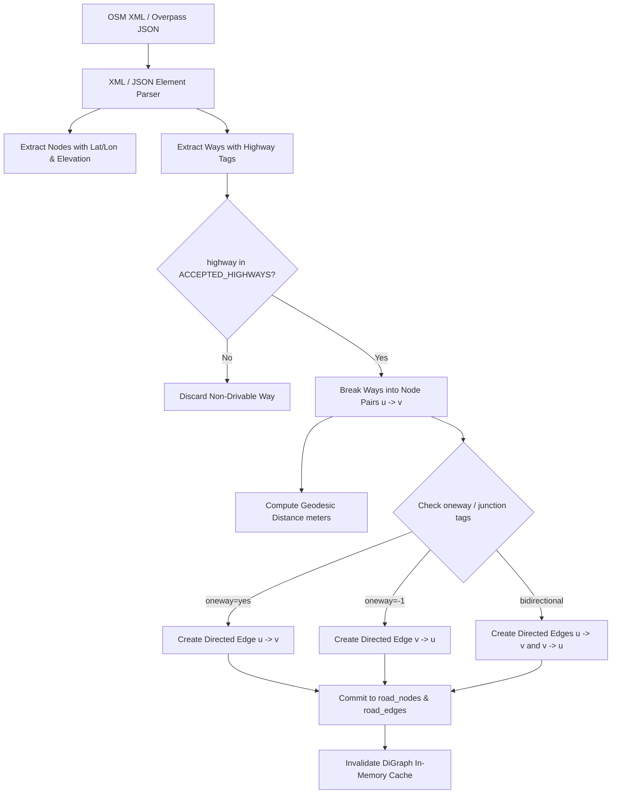

# RouteIQ 2.0 — OpenStreetMap (OSM) Ingestion Engine

## 1. Overview

The OpenStreetMap (OSM) ingestion engine in RouteIQ 2.0 transforms raw geographic data into topologically sound directed graph segments.

In mountainous and riverine terrain like the North Eastern Region, raw OSM data contains pedestrian paths, bridleways, tracks, waterways, and complex multi-lane attributes. The ingestion engine strips away non-drivable infrastructure, standardizes directionality, computes geodesic lengths, and models elevations.

---

## 2. Ingestion Pipeline Workflow

---

## 3. Drivable Road Classification Filter

The ingestion pipeline restricts road segments to the following logistics-capable classifications:

| Highway Tag | RouteIQ Functional Role | Example in NER |
|---|---|---|
| `motorway` | High-speed divided expressways | Asian Highway corridors |
| `trunk` | National Highway multi-lane arteries | NH-06, NH-27, NH-29 |
| `primary` | Major state highways and inter-district links | GS Road, State Highway 1 |
| `secondary` | Connecting secondary towns and district hubs | Jowai-Nartiang, Tezpur rural |
| `tertiary` | Local access roads to villages and tea estates | Hill village access roads |
| `unclassified` | Paved rural connectivity | PMGSY rural roads |
| `residential` | Urban last-mile delivery streets | Police Bazar Shillong streets |
| `service` | Industrial depot, logistics park access | Khanapara depot alleys |
| `*_link` | Interchange ramps and turning bypasses | Corridor entry/exit ramps |

Non-drivable classifications (`footway`, `cycleway`, `path`, `bridleway`, `steps`, `pedestrian`, `track`) are filtered out automatically.

---

## 4. Pure-Python Haversine Formulation

To eliminate binary C-extension dependencies (such as GDAL or GEOS wheel incompatibilities on Windows / Python 3.14), RouteIQ 2.0 calculates segment lengths using the pure-Python Haversine formula:

$$\Delta\phi = \phi_2 - \phi_1$$
$$\Delta\lambda = \lambda_2 - \lambda_1$$
$$a = \sin^2\left(\frac{\Delta\phi}{2}\right) + \cos(\phi_1)\cos(\phi_2)\sin^2\left(\frac{\Delta\lambda}{2}\right)$$
$$c = 2 \cdot \text{atan2}\left(\sqrt{a}, \sqrt{1-a}\right)$$
$$d = R \cdot c \quad \text{where } R = 6,371,000 \text{ meters}$$

---

## 5. Offline Test Fixture

Automated testing never relies on third-party Overpass network calls. A deterministic, reproducible fixture is provided in `backend/tests/fixtures/sample_ner_osm.xml`:
- Models the **Guwahati — Shillong — Silchar (NH-06)** corridor.
- 10 nodes (including elevations up to 1,720m in Upper Shillong).
- 5 ways with trunk, primary, secondary roads, oneway urban streets, and multi-lane configurations.
- Generates exactly 17 directed graph edges upon ingestion.
