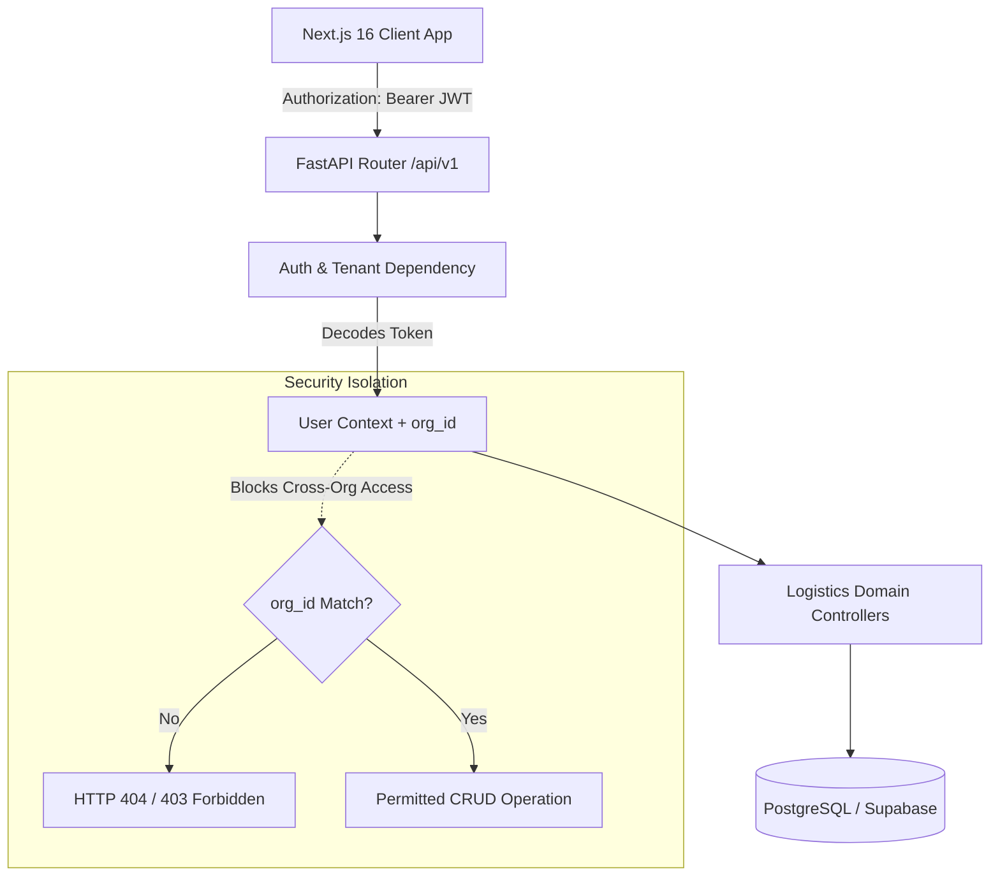

# RouteIQ 2.0 — Phase 2: Authentication & Core Logistics Data

## 1. Executive Summary

Phase 2 establishes the foundational identity, multi-tenant security boundary, and core operational data entities for RouteIQ 2.0. By implementing secure authentication and tenant-isolated data models for Organizations, Users, Vehicles, Locations, and Deliveries, Phase 2 provides the clean, strongly-typed data substrate necessary for downstream graph ingestion, risk assessment, and routing engines.

---

## 2. Phase 2 Scope & Strictly Enforced Boundaries

### Included in Phase 2
- **Authentication**: User registration, password hashing with bcrypt, JWT token issuance, session verification, client logout.
- **Authorization & Multi-Tenancy**: Three-tier Role-Based Access Control (`admin`, `manager`, `operator`) and strict organization isolation (`organization_id`).
- **Logistics Entities**:
  - `organizations`: Business tenancy boundary.
  - `vehicles`: Fleet asset capacities, vehicle types, and operational states (`available`, `assigned`, `maintenance`, `inactive`).
  - `locations`: Physical logistics hubs, depots, and address stops with coordinate boundary validation (lat [-90, 90], lon [-180, 180]).
  - `deliveries`: Consignment orders with pickup/delivery location references, weight/volume metrics, priority levels, status transitions, and chronological time windows (`start <= end`).
- **API Surface**: 20+ versioned REST endpoints mounted under `/api/v1/`.
- **Frontend Console**: Next.js 16 UI pages for `/login`, `/register`, `/dashboard`, `/vehicles`, `/locations`, and `/deliveries`.
- **Automated Tests**: Comprehensive pytest test suite covering unit crypto logic, REST CRUD operations, and cross-tenant security isolation.

### Strictly Omitted (Deferred to Phase 3+)
- Map visualizers, Leaflet/Mapbox layers, interactive maps
- Geocoding and reverse geocoding
- Road network graph representations and OSM ingestion (Phase 3)
- Terrain risk assessment, landslide/flood hazard modeling (Phase 3)
- Multi-objective routing optimization and OR-Tools/VRP (Phase 4)
- Live GPS vehicle tracking and telemetry
- Cloud production deployments

---

## 3. Architecture Highlights

---

## 4. Verification & Quality Gates Summary

| Verification Category | Requirement | Result |
|---|---|---|
| **Backend Unit & API Tests** | 100% pytest suite pass rate | **19/19 PASSED** (8.05s) |
| **Cross-Tenant Security** | Org A user blocked from accessing Org B data | **VERIFIED & TESTED** |
| **Frontend TypeScript Build** | Clean production build with 0 errors | **COMPILED & PASSED** |
| **Coordinate Validation** | Lat [-90, 90], Lon [-180, 180] enforced | **VERIFIED** |
| **Time Window Validation** | `start <= end` constraint enforced | **VERIFIED** |
| **Password Protection** | Bcrypt hash with zero plaintext storage | **VERIFIED** |
