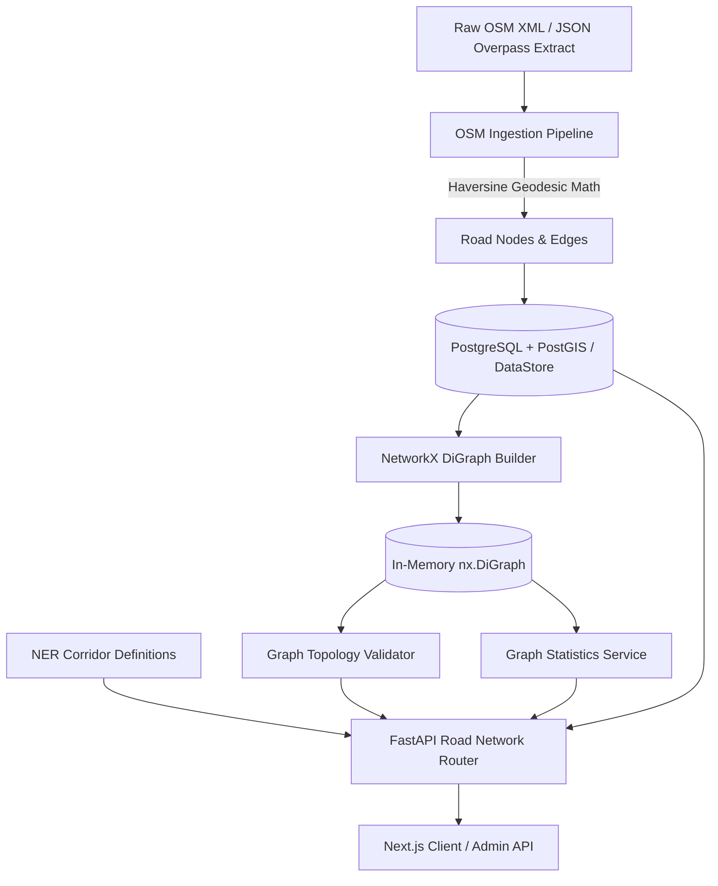

# RouteIQ 2.0 — Phase 3: Road Network Graph & OSM Ingestion

## 1. Executive Summary

Phase 3 implements the foundational spatial road network graph and OpenStreetMap (OSM) ingestion pipeline for RouteIQ 2.0. Tailored specifically for India's North Eastern Region (NER), Phase 3 converts raw geographic road vectors into a strongly-typed, topologically-validated, and directed NetworkX spatial graph model (`nx.DiGraph`).

By modeling road nodes with elevations, road segments with geodesic lengths and directionality, and cataloging 7 strategic NER highway corridors, Phase 3 establishes the physical road network substrate needed for multi-objective routing, terrain hazard modeling, and vehicle dispatching in subsequent phases.

---

## 2. Phase 3 Scope & Strictly Enforced Boundaries

### Included in Phase 3
- **Spatial PostGIS Schema**:
  - `road_nodes`: Unique OSM nodes, latitude, longitude, elevation in meters, GIST spatial index.
  - `road_edges`: Directed road segments, source/target node references, road classifications (`trunk`, `primary`, etc.), geodesic length in meters, speed limits, oneway flags, GIST LineString spatial index.
- **NER Strategic Transport Corridors**:
  - Catalog of 7 major lifelines across 8 NER states (NH-06, NH-27, NH-29/02, NH-08, NH-306, NH-15/415, NH-10).
  - Exact geographic waypoints with coordinates, elevations, and terrain/hazard notes.
- **OpenStreetMap Ingestion Engine**:
  - XML & JSON parser for Overpass API extracts.
  - Pure-Python Haversine distance calculator (no C-extension compilation dependencies).
  - Configurable drivable road class filtering (`motorway`, `trunk`, `primary`, `secondary`, `tertiary`, `unclassified`, `residential`, `service`).
  - Oneway and roundabout directionality resolution.
  - Deterministic offline test fixture (`sample_ner_osm.xml`).
- **Topological Graph Layer (NetworkX)**:
  - In-memory thread-safe `nx.DiGraph` builder and cache manager.
  - Edge weights assigned to geodesic lengths in meters.
  - Graph integrity validation (coordinate bounds, positive length, dead ends, isolated nodes, component connectivity).
  - Graph statistics service (nodes, edges, km, component ratios, road class breakdown, bounding box).
- **Spatial REST APIs**:
  - `GET /api/v1/road-network/corridors`
  - `GET /api/v1/road-network/corridors/{id}`
  - `GET /api/v1/road-network/stats`
  - `GET /api/v1/road-network/health`
  - `GET /api/v1/road-network/nodes` (with bounding-box query parameters)
  - `GET /api/v1/road-network/edges` (with road-type and bounding-box filters)
  - `POST /api/v1/road-network/ingest` (Admin-only RBAC protection)
- **Render Cloud Deployment**:
  - Zero-downtime infrastructure blueprint (`render.yaml`).
- **Comprehensive Automated Testing**:
  - 11 new Phase 3 tests covering geodesic math, ingestion, graph construction, directionality, validation heuristics, and API endpoints (30/30 total tests passing).
- **Frontend Integration**:
  - TypeScript types and API client functions in `frontend/src/lib/api.ts`.

### Strictly Omitted (Deferred to Phase 4 & Phase 5)
- Google OR-Tools or Vehicle Routing Problem (VRP) solving
- Shortest / fastest / safest / balanced route computation algorithms (Phase 4)
- Live traffic APIs and real-time congestion feeds
- Live weather APIs and precipitation feeds
- Dynamic monsoon flood and landslide machine learning prediction models
- Interactive Mapbox GL / Leaflet UI map rendering (Phase 5)

---

## 3. Architecture Overview

---

## 4. Verification & Test Metrics

- **Backend Pytest Suite**: 30/30 tests passing (100% pass rate).
- **Baseline Integrity**: All 19 Phase 1 & Phase 2 tests continue passing without regression.
- **Frontend TypeScript Build**: Clean compilation of 10/10 static pages with 0 errors.
