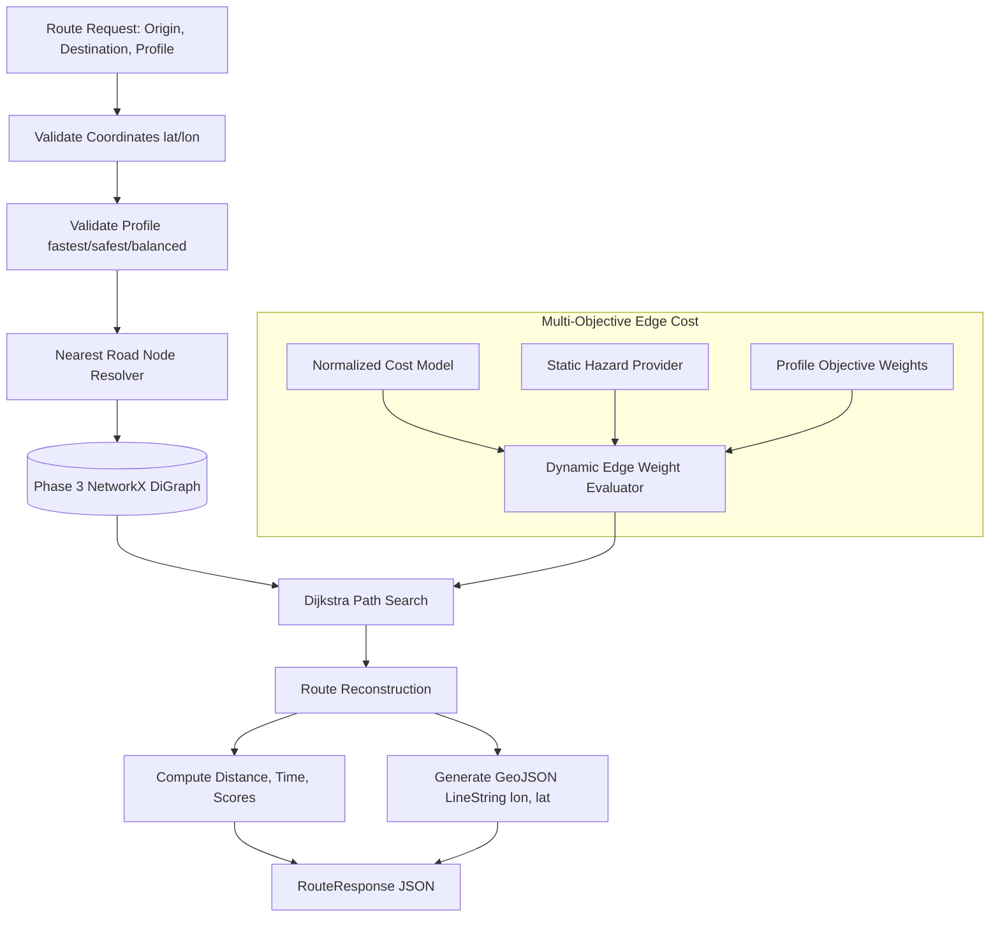

# RouteIQ 2.0 — Phase 4: Multi-Objective Routing Optimization

## 1. Executive Summary

Phase 4 delivers the production-quality **Multi-Objective Route Optimization Engine** for RouteIQ 2.0. Built directly upon the Phase 3 NetworkX spatial road graph (`nx.DiGraph`), the engine calculates optimized routes across India's North Eastern Region (NER) by simultaneously balancing travel distance, estimated transit time, terrain difficulty, and monsoonal hazard risk.

Phase 4 supports three primary routing profiles:
1. **Fastest**: Prioritizes transit duration along high-speed corridors.
2. **Safest**: Prioritizes hazard avoidance, minimizing exposure to landslides, steep slopes, and flood-prone terrain.
3. **Balanced**: Pragmatic multi-objective equilibrium balancing delivery schedule efficiency with corridor safety.

---

## 2. Phase 4 Scope & Strictly Enforced Boundaries

### Included in Phase 4
- **Modular Routing Subsystem** (`backend/app/routing/`):
  - `profiles.py`: Centralized configuration for `fastest`, `safest`, and `balanced` objective weights.
  - `cost_model.py`: Multi-criteria normalized edge cost evaluation and regional speed fallbacks by highway classification.
  - `risk_model.py`: Deterministic modular risk scoring (`HazardProvider`, `StaticHazardProvider`) covering flood, landslide, monsoon surface degradation, and terrain gradient.
  - `pathfinder.py`: Multi-objective path search using NetworkX (`dijkstra_path` with dynamic weight functions) without in-place mutation of the shared road graph.
  - `optimizer.py`: Route optimizer coordinating single-profile calculations and multi-profile comparisons without winner/ranking bias.
  - `route_service.py`: End-to-end routing service with spatial nearest-node resolution and route reconstruction.
  - `geometry.py`: GeoJSON `LineString` generator adhering to `[longitude, latitude]` standards.
  - `validators.py`: Geographic coordinate bounds and profile validation.
  - `schemas.py`: Strongly typed Pydantic models for requests, responses, metrics, and risk breakdowns.
  - `exceptions.py`: Typed domain errors with clean HTTP status mappings.
- **REST APIs** (`backend/app/api/v1/endpoints/routing.py`):
  - `POST /api/v1/routing/route`: Single-profile route calculation.
  - `GET /api/v1/routing/profiles`: Catalog of available profiles and objective weights.
  - `GET /api/v1/routing/health`: Routing engine readiness and graph statistics.
  - `POST /api/v1/routing/compare`: Side-by-side comparison across all 3 profiles.
- **Frontend Integration**:
  - TypeScript interfaces and API methods in `frontend/src/lib/api.ts`.
- **Automated Testing**:
  - 14 new Phase 4 routing tests covering validation, nearest-node lookup, cost models, pathfinding, oneway enforcement, and API endpoints (44/44 total tests passing).

### Strictly Omitted (Deferred to Phase 5)
- Interactive Mapbox GL / Leaflet UI map rendering
- Live vehicle GPS tracking and telemetry
- Driver turn-by-turn navigation or voice guidance
- Dispatch management dashboard
- Real-time traffic feeds
- Live weather or precipitation APIs
- External satellite or ML prediction feeds
- Google OR-Tools / Delivery Vehicle Routing Problem (VRP) solving

---

## 3. End-to-End Routing Pipeline

---

## 4. Verification & Quality Gates Summary

| Verification Gate | Target | Result | Status |
|---|---|---|---|
| **Phase 1 Baseline Tests** | 6 tests passing | 6/6 PASSED | **PASS** |
| **Phase 2 Baseline Tests** | 13 tests passing | 13/13 PASSED | **PASS** |
| **Phase 3 Road Network Tests** | 11 tests passing | 11/11 PASSED | **PASS** |
| **Phase 4 Routing Tests** | 14 tests passing | 14/14 PASSED | **PASS** |
| **Total Backend Test Suite** | 44 tests passing | **44/44 PASSED** (6.99s) | **PASS** |
| **Oneway Directionality** | Forward allowed, reverse rejected | Verified | **PASS** |
| **Frontend TypeScript Build** | Next.js 16 build passing | **10/10 static pages cleanly compiled (0 errors)** | **PASS** |
| **Tenant Isolation** | Zero cross-tenant data leakage | Verified | **PASS** |
