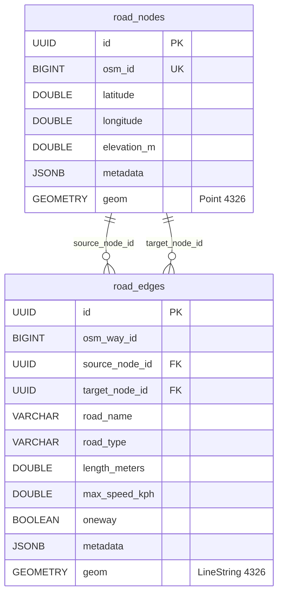

# RouteIQ 2.0 — Road Network Architecture & Corridors

## 1. Physical Road Network Model

The road network in RouteIQ 2.0 represents the physical geography of India's North Eastern Region (NER). Unlike tenant-scoped operational data (such as vehicles, locations, or consignments), the road network is modeled as **shared regional infrastructure**. All organizations operate on top of the same underlying physical road graph.

### Relational Schema

---

## 2. Strategic NER Road Corridors

Due to severe monsoonal flooding, active landslide zones, and mountainous bottlenecks, RouteIQ 2.0 catalogs 7 primary highway lifelines serving the 8 states of Northeast India:

| Corridor ID | National Highway | Route Path | Length (km) | Terrain & Vulnerability Profile |
|---|---|---|---|---|
| `guwahati-shillong-silchar` | **NH-06** | Guwahati (Khanapara) → Nongpoh → Shillong → Jowai → Silchar | 320 km | Hilly plateau, steep descents into Barak Valley. Chronic monsoon landslides between Shillong and Jowai. |
| `siliguri-guwahati` | **NH-27** | Siliguri → Jalpaiguri → Alipurduar → Bongaigaon → Guwahati | 475 km | East-West highway corridor traversing the strategic 'Chicken's Neck' gateway into Assam floodplains. |
| `dimapur-kohima-imphal` | **NH-29 / NH-02** | Dimapur → Chumukedima → Kohima → Mao Gate → Imphal | 215 km | Rugged mountain corridor, sole road lifeline connecting Manipur to railhead at Dimapur. Severe mudslides at Pagla Pahar. |
| `shillong-agartala` | **NH-08** | Shillong → Badarpur → Karimganj → Dharmanagar → Agartala | 460 km | Southern arterial linking Tripura to Meghalaya plateau. High rainfall and border corridor constraints. |
| `silchar-aizawl` | **NH-306** | Silchar → Vairengte → Kolasib → Sairang → Aizawl | 178 km | Steep ridge corridor carrying essential commodities into Mizoram capital. Highly prone to sinking zones. |
| `guwahati-itanagar` | **NH-15 / NH-415** | Guwahati → Mangaldai → Tezpur → Banderdewa → Itanagar | 330 km | Brahmaputra North Bank plain traversing into Papum Pare foothills. Prone to river flash flooding. |
| `siliguri-gangtok` | **NH-10** | Siliguri → Sevoke → Kalijhora → Rangpo → Gangtok | 114 km | Deep Teesta River gorge corridor. Chronic monsoon washing away at 29th Mile and Coronation Bridge. |

---

## 3. Road Network REST APIs

Mounted under `/api/v1/road-network`:

### Query Corridors
- `GET /api/v1/road-network/corridors`
  - Returns list of all 7 NER corridors with waypoints and terrain notes.
  - Requires: Authenticated user (`Bearer <jwt>`).
- `GET /api/v1/road-network/corridors/{corridor_id}`
  - Returns detailed waypoint coordinates, elevations, and states for specific corridor.

### Network Topology & Health
- `GET /api/v1/road-network/stats`
  - Returns graph summary: `total_nodes`, `total_edges`, `total_length_km`, `weakly_connected_components`, `strongly_connected_components`, `largest_component_ratio`, `road_type_distribution`, `bounding_box`.
- `GET /api/v1/road-network/health`
  - Returns topology diagnostics: `status` (`healthy`, `degraded`, `empty`), `is_connected`, `isolated_nodes`, `dead_ends`, `warnings`.

### Spatial Nodes and Edges
- `GET /api/v1/road-network/nodes?min_lat=...&max_lat=...&min_lon=...&max_lon=...&limit=100&offset=0`
  - Returns paginated nodes with optional bounding-box spatial filter.
- `GET /api/v1/road-network/edges?road_type=...&min_lat=...&max_lat=...&limit=100&offset=0`
  - Returns paginated road segments filtered by road class and bounding box.

### Admin Ingestion
- `POST /api/v1/road-network/ingest`
  - Ingests raw OSM XML or parses server fixture file.
  - Requires: Admin role (`require_role(["admin"])`).
