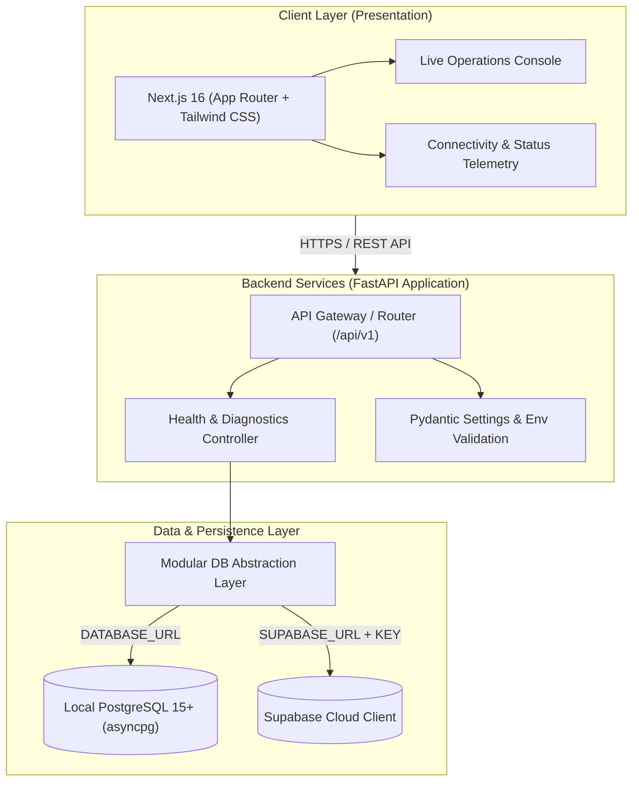
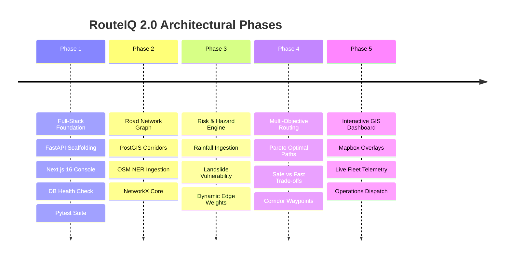

# RouteIQ 2.0 — System Architecture

## 1. Architectural Vision

RouteIQ 2.0 is built to reframe logistics dispatch across India's North Eastern Region (NER). Unlike standard navigation utilities that optimize solely for planar Euclidean distance or historical travel times, RouteIQ 2.0 incorporates terrain topology, seasonal monsoonal precipitation, dynamic slope vulnerability, and infrastructure chokepoints.

The system is designed around four key tenets:
1. **Modular Decoupling**: Frontend, backend, graph engine, and persistence layers interact strictly through typed interfaces and REST contracts.
2. **Graceful Fault Tolerance**: High mountain corridors experience frequent communication loss. Components degrade gracefully in offline or partially connected conditions.
3. **Multi-Database Capability**: Native compatibility with standard local PostgreSQL instances (development and air-gapped deployments) and Supabase (managed cloud deployment).
4. **Zero-Trust Secret Management**: Credential-free codebases relying purely on validated runtime environment variables.

---

## 2. High-Level System Architecture

---

## 3. Component Architecture Breakdown

### 3.1 Presentation Layer (`frontend/`)
- **Framework**: Next.js 16 (React 19, TypeScript, Turbopack).
- **Styling**: Tailwind CSS v4 with dark-mode logistics theme.
- **Client Components**:
  - `Header.tsx`: Global branding, system version, and live ping badge.
  - `ConnectivityStatus.tsx`: Real-time backend polling, latency measurement, database connectivity inspection, and JSON payload viewer.
  - `OverviewCards.tsx`: High-level summaries of NER logistics corridors, hazard awareness, and upcoming routing waves.
  - `Phase1Checklist.tsx`: Live validation status of all Phase 1 architectural deliverables.
- **Data Client (`src/lib/api.ts`)**: Strongly-typed HTTP client executing non-blocking diagnostics against backend `/health`.

### 3.2 Application & API Layer (`backend/`)
- **Framework**: FastAPI (Python 3.10+).
- **ASGI Server**: Uvicorn.
- **Lifespan Management**: Structured startup/shutdown hooks in `app/main.py`.
- **CORS Protection**: Origin filtering strictly enforced via `settings.CORS_ORIGINS`.
- **Configuration Engine (`app/core/config.py`)**:
  - Pydantic Settings with automatic `.env` parsing.
  - Dynamic CORS parser handling comma-delimited strings or JSON arrays.
  - Zero hardcoded fallback credentials.
- **Diagnostic Controller (`app/api/v1/endpoints/health.py`)**:
  - Root `/health` and versioned `/api/v1/health`.
  - Non-blocking execution of database connectivity checks.

### 3.3 Database & Persistence Layer (`database/` & `backend/app/db/`)
- **Modularity Strategy**: The database access layer in `app/db/session.py` acts as an agnostic facade.
  - **Local PostgreSQL Mode**: Uses high-performance asynchronous connection pooling via `asyncpg`.
  - **Supabase Cloud Mode**: Uses the official `supabase-py` SDK for managed projects.
  - **Decoupled Mode**: If neither database is provisioned during initial setup, the backend boots cleanly, reporting an informative status without throwing unhandled exceptions.
- **Schema Design (`database/schema.sql`)**:
  - `nodes`: Geographic logistics hubs, border crossings, and mountain passes across Assam, Meghalaya, Arunachal Pradesh, Nagaland, Manipur, Mizoram, Tripura, and Sikkim.
  - `edges`: Road corridors connecting nodes, capturing distance, base transit time, road quality, and terrain characteristics (`plains`, `hilly`, `mountainous`).
  - `hazard_reports`: Active landslides, flood blockages, and bridge failures.
  - `system_health_pings`: Audit trail for connectivity verification.

---

## 4. Security & Isolation Model

1. **Strict Secrets Boundary**:
   - Environment templates (`.env.example`) contain only descriptive placeholders.
   - All `.env` and `.env*.local` files are enforced in `.gitignore`.
2. **Database Resilience**:
   - Database queries execute with strict connection timeouts (3.0 seconds) to prevent health check hangs.
3. **CORS Isolation**:
   - Only explicitly configured frontend origins are authorized for cross-origin API access.

---

## 5. Multi-Phase Architectural Trajectory

